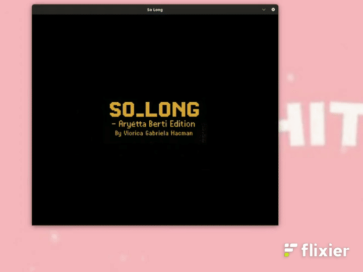

# So_Long

[](https://github.com/vhacman/so_long)
[](https://en.wikipedia.org/wiki/C_(programming_language))
[](https://github.com/42School/norminette)
[](https://valgrind.org/)
[]()
[]()
[]()
[]()

---

## 📚 Indice
- [Descrizione 📖](#descrizione-)
- [Requisiti 📦](#requisiti-)
- [Build](#build)
- [Esecuzione](#esecuzione)
- [Gameplay 🎮](#gameplay-)
- [Bonus 🧠](#bonus-)
- [Previw Mandatory](#preview_mandatory)
- [Previw Bonus](#preview_bonus)
- [Contatti 🧑‍💻](#contatti-)

--
## Descrizione 📖

**So Long** è un mini-gioco realizzato in C utilizzando la MiniLibX (MLX), parte del curriculum 42. L'obiettivo è guidare un personaggio su una mappa 2D, raccogliendo tutti gli oggetti (`C`) e raggiungendo l'uscita (`E`) evitando ostacoli (`1`) e nemici (`X`).

Il progetto prevede due versioni:
- **Mandatory**: logica base, rendering statico, validazioni mappa.
- **Bonus**: animazioni, nemico mobile, interfaccia migliorata, schermate dinamiche.

---
## Requisiti 📦

- OS: Linux (MLX non compatibile con Windows nativamente)
- Compilatore: `gcc`
- Librerie: `MiniLibX`, `X11`, `Xext`
- Strumenti utili: `valgrind`, `make`

---
 
## Build

```bash
make            # compila mandatory
make bonus      # compila bonus
make re         # ricompila da capo 
make clean      # rimuove i file oggetto (.o)
make fclean     # rimuove .o e binario
```
## Esecuzione:

```
./sp_long mappa.ber
```
---
## Gameplay 🎮
Mappa caricata da file .ber nella cartella src/maps/.

Controlli:
- W / ↑ : su
- S / ↓ : giù
- A / ← : sinistra
- D / → : destra
- ESC / tasto x : uscita

 Il giocatore deve raccogliere tutti i C per attivare l’uscita E.

---
## Bonus 🧠
La versione bonus include:

- Nemico che segue un percorso predefinito (pathfinding DFS).
- Collisione con il nemico = sconfitta.
- Animazione dei collectibles (C) su 4 frame.
- Schermate di intro, vittoria e sconfitta.
- Messaggio temporaneo se si tenta di uscire senza aver raccolto tutto.
- Conteggio mosse in sovraimpressione.

## Preview_mandatory



## Contatti 🧑‍💻
[](https://www.linkedin.com/in/viorica-gabriela-hacman-63a412267/)
[](https://www.facebook.com/profile.php?id=100090802467237)
[](https://www.instagram.com/vgabrielah_/)

---
